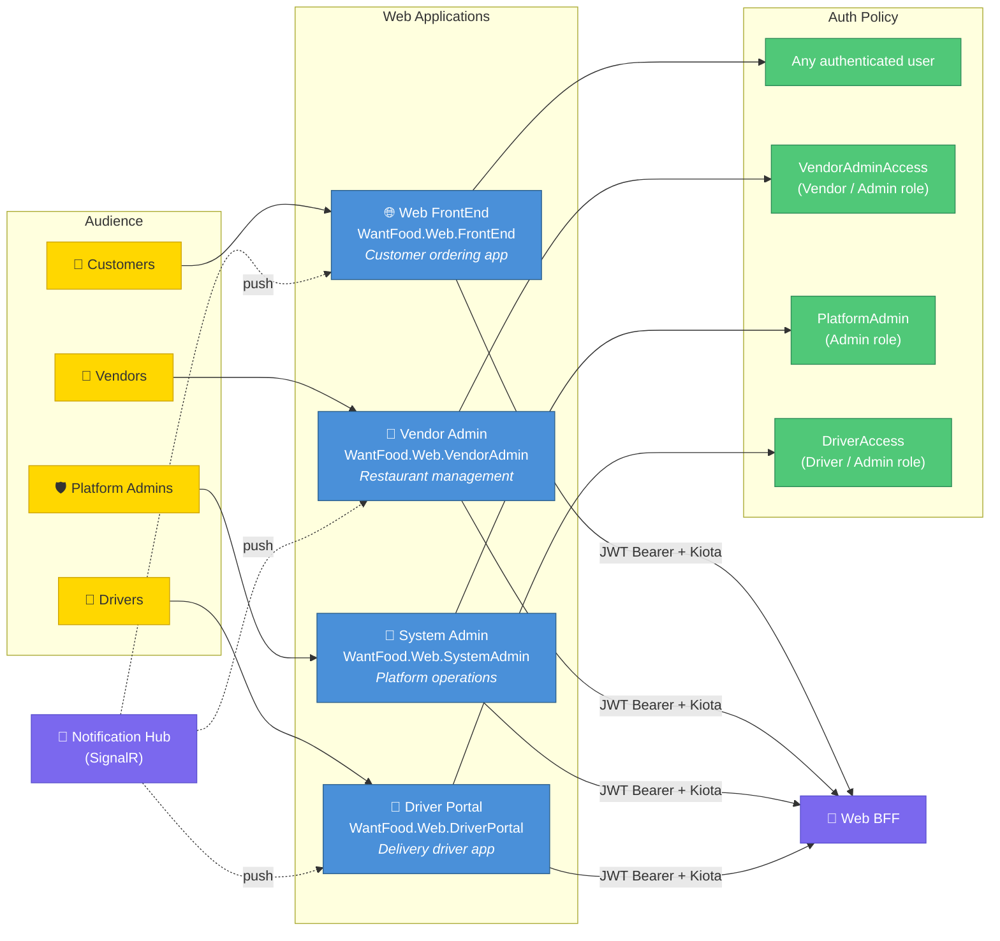
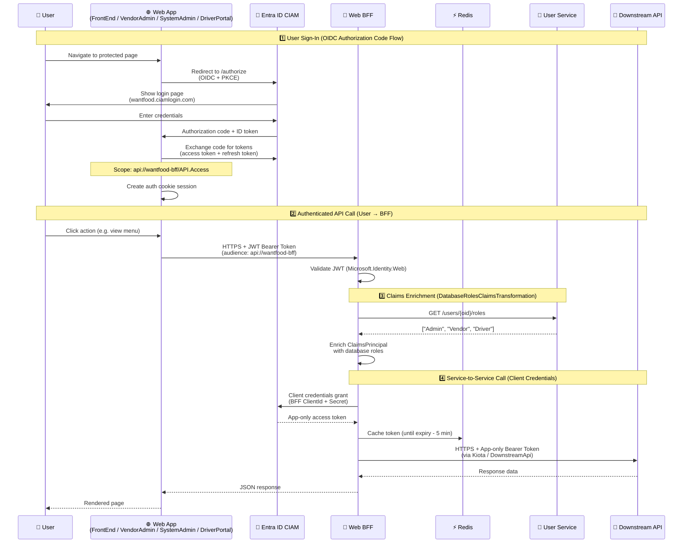
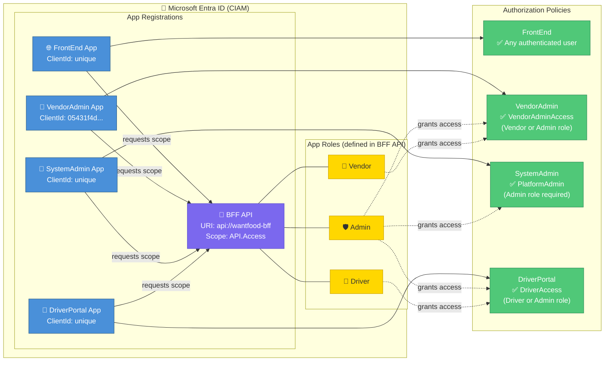

# WantFood Architecture Diagram

## ⚠️ Environment-Specific Infrastructure

This diagram shows a **split architecture** across dev/staging and production environments:

- **Dev/Staging** (local Aspire or staging Azure Container Apps): Uses **RabbitMQ** for messaging and **Elasticsearch** for search
- **Production** (Azure Container Apps): Uses **Azure Service Bus** (Standard tier) for messaging and **Azure AI Search** for search
- **Future**: Migration to **Azure OpenAI Search** for semantic/hybrid search capabilities

All microservices and functions are coded to use **MassTransit** for messaging and **ISearchClient** for search, making the infrastructure swap transparent to application code.

## Full System Architecture

```mermaid
graph TB
    subgraph Identity["Identity Provider"]
        EntraID["🔐 Microsoft Entra ID<br/>(CIAM)"]
        AppRegs["📋 App Registrations<br/>FrontEnd · VendorAdmin<br/>SystemAdmin · DriverPortal · BFF API"]
        EntraID --- AppRegs
    end

    subgraph Clients["Client Applications"]
        direction LR
        WebFrontEnd["🌐 Web FrontEnd<br/>(Razor Pages)"]
        VendorAdmin["🏪 Vendor Admin<br/>(Razor Pages)"]
        SystemAdmin["🔧 System Admin<br/>(Razor Pages)"]
        DriverPortal["🚗 Driver Portal<br/>(Razor Pages)"]
        MobileApp["📱 Mobile App<br/>(Future)"]
    end

    subgraph Edge["Edge Security & Delivery"]
        FrontDoor["🌍 Azure Front Door"]
        WAF["🛡️ WAF Policy"]
        CDN["🚀 Azure CDN"]
        FrontDoor --- WAF
    end

    subgraph BFFLayer["BFF Layer"]
        WebBFF["🔀 Web BFF<br/>(ASP.NET Core)"]
        ClaimsTransform["🏷️ Claims Transformation<br/>(DB Role Enrichment)"]
        TokenCache["🗝️ Token Cache<br/>(Redis)"]
        NotificationHub["📡 Notification Hub<br/>(SignalR)"]
        MobileBFF["🔀 Mobile BFF<br/>(Future)"]
        WebBFF --- ClaimsTransform
        WebBFF --- TokenCache
    end

    subgraph Microservices["Microservices"]
        UserService["👤 User Service<br/>(ASP.NET Core API)"]
        VendorService["🍕 Vendor Service<br/>(ASP.NET Core API)"]
        OrderService["📋 Order Service<br/>(ASP.NET Core API)"]
        PaymentService["💳 Payment Service<br/>(ASP.NET Core API)<br/>+ Stripe"]
        DeliveryService["🚗 Delivery Service<br/>(ASP.NET Core API)"]
        SearchService["🔍 Search Service<br/>(ASP.NET Core API)<br/>+ OpenAI"]
        NotificationService["📧 Notification Service<br/>(ASP.NET Core API)"]
        ChatService["💬 Chat Service<br/>(ASP.NET Core API)<br/>+ ACS"]
        PromotionService["🎯 Promotion Service<br/>(ASP.NET Core API)"]
        CopilotService["🤖 Copilot Service<br/>(ASP.NET Core API)<br/>+ Azure OpenAI"]
        ContentService["📰 Content Service<br/>(ASP.NET Core API)"]
        FileService["📁 File Service<br/>(ASP.NET Core API)"]
    end

    subgraph Functions["Azure Functions (Background Jobs)"]
        UserFns["⏱️ User Service Functions<br/>(events / queue triggers)"]
        OrderFns["⏱️ Order Service Functions<br/>(timers / queue triggers)"]
        FileFns["⏱️ File Service Functions<br/>(blob / queue triggers)"]
    end

    subgraph External["External Integrations"]
        Stripe["💳 Stripe<br/>(Payments + Webhooks)"]
        StripeCli["🧪 Stripe CLI<br/>(Local webhook forwarder)"]
        GoogleMaps["🗺️ Google Maps"]
        GraphApi["📇 Microsoft Graph API"]
        OpenAI["🤖 OpenAI / Azure OpenAI"]
        ACS["📞 Azure Communication Services"]
    end

    subgraph AzureInfra["Azure / Aspire Infrastructure"]
        SQLServer[("🗄️ SQL Server")]
        Messaging["📬 Messaging Bus"]
        BlobStorage["📦 Azure Blob Storage<br/>(Azurite)"]
        Redis["⚡ Redis Cache"]
        SearchEngine["🔎 Search Engine"]
        SMTP["✉️ SMTP (smtp4dev)"]
        KeyVault["🔐 Azure Key Vault"]
        AppInsights["📈 Application Insights"]
        LogAnalytics["📊 Log Analytics"]
    end
    
    subgraph DevStaging["Dev/Staging Layer"]
        RabbitMQ["🐰 RabbitMQ<br/>(MassTransit)"]
        Elasticsearch["🔎 Elasticsearch"]
    end
    
    subgraph ProdAzure["Production Azure"]
        ServiceBus["📬 Azure Service Bus<br/>(MassTransit)"]
        AICognitive["🤖 Azure AI Search<br/>(Cognitive Search)"]
    end
    
    Messaging -.->|dev/staging| RabbitMQ
    Messaging -.->|production| ServiceBus
    SearchEngine -.->|dev/staging| Elasticsearch
    SearchEngine -.->|production| AICognitive

    subgraph Databases["SQL Server Databases"]
        UserDB[("User DB")]
        VendorDB[("Vendor DB")]
        OrderDB[("Order DB")]
        DeliveryDB[("Delivery DB")]
        NotificationDB[("Notification DB")]
        ChatDB[("Chat DB")]
        PromotionDB[("Promotion DB")]
        ContentDB[("Content DB")]
    end

    %% Auth: Clients authenticate via Entra ID (OIDC)
    WebFrontEnd <-->|OIDC / OpenID Connect| EntraID
    VendorAdmin <-->|OIDC / OpenID Connect| EntraID
    SystemAdmin <-->|OIDC / OpenID Connect| EntraID
    DriverPortal <-->|OIDC / OpenID Connect| EntraID
    MobileApp -.->|OIDC| EntraID

    %% Client to BFF connections (with access tokens)
    VendorAdmin -->|JWT Bearer Token| FrontDoor
    SystemAdmin -->|JWT Bearer Token| FrontDoor
    WebFrontEnd -->|JWT Bearer Token| FrontDoor
    DriverPortal -->|JWT Bearer Token| FrontDoor
    MobileApp -.->|JWT Bearer Token| MobileBFF
    FrontDoor --> WAF --> WebBFF
    CDN -.->|static assets| WebFrontEnd
    CDN -.->|static assets| VendorAdmin
    CDN -.->|static assets| DriverPortal

    %% Real-time push notifications (SignalR)
    NotificationHub -.->|WebSocket / SignalR| WebFrontEnd
    NotificationHub -.->|WebSocket / SignalR| VendorAdmin
    NotificationHub -.->|WebSocket / SignalR| DriverPortal

    %% BFF to Microservices (client credentials / OBO)
    WebBFF -->|Client Credentials<br/>+ Kiota| UserService
    WebBFF -->|Client Credentials<br/>+ Kiota| VendorService
    WebBFF -->|Client Credentials<br/>+ Kiota| OrderService
    WebBFF -->|Client Credentials<br/>+ Kiota| PaymentService
    WebBFF -->|Client Credentials<br/>+ Kiota| DeliveryService
    WebBFF -->|Client Credentials<br/>+ Kiota| SearchService
    WebBFF -->|Client Credentials<br/>+ Kiota| NotificationService
    WebBFF -->|Client Credentials<br/>+ Kiota| ChatService
    WebBFF -->|Client Credentials<br/>+ Kiota| PromotionService
    WebBFF -->|Client Credentials<br/>+ Kiota| CopilotService
    WebBFF -->|Client Credentials<br/>+ Kiota| ContentService
    WebBFF -->|Client Credentials<br/>+ Kiota| FileService
    WebBFF --- Redis

    %% Claims enrichment from User DB
    ClaimsTransform -->|Fetch Roles| UserService

    %% Microservice to Database
    UserService --- UserDB
    VendorService --- VendorDB
    OrderService --- OrderDB
    DeliveryService --- DeliveryDB
    NotificationService --- NotificationDB
    ChatService --- ChatDB
    PromotionService --- PromotionDB
    ContentService --- ContentDB
    SQLServer -.- UserDB
    SQLServer -.- VendorDB
    SQLServer -.- OrderDB
    SQLServer -.- DeliveryDB
    SQLServer -.- NotificationDB
    SQLServer -.- ChatDB
    SQLServer -.- PromotionDB
    SQLServer -.- ContentDB

    %% Microservice to Azure Services
    UserService --- BlobStorage
    VendorService --- BlobStorage
    OrderService --- BlobStorage
    DeliveryService --- BlobStorage
    PaymentService --- BlobStorage
    ContentService --- BlobStorage
    FileService --- BlobStorage
    WebFrontEnd --- BlobStorage

    %% Messaging bus (abstracted for dev/staging vs prod)
    UserService --- Messaging
    VendorService --- Messaging
    OrderService --- Messaging
    PaymentService --- Messaging
    DeliveryService --- Messaging
    SearchService --- Messaging
    NotificationService --- Messaging
    ChatService --- Messaging
    PromotionService --- Messaging
    CopilotService --- Messaging
    ContentService --- Messaging
    FileService --- Messaging
    NotificationHub --- Messaging
    UserFns --- Messaging
    OrderFns --- Messaging
    FileFns --- Messaging

    %% Functions DB / storage references
    OrderFns --- OrderDB
    OrderFns --- BlobStorage
    FileFns --- BlobStorage

    %% Specialised infra usage (abstracted for dev/staging vs prod)
    SearchService --- SearchEngine
    NotificationService --- SMTP
    UserService --- Redis
    VendorService --- Redis
    OrderService --- Redis
    SearchService --- Redis
    PromotionService --- Redis
    ContentService --- Redis
    NotificationHub --- Redis
    WebBFF --- KeyVault
    UserService --- KeyVault
    VendorService --- KeyVault
    OrderService --- KeyVault
    PaymentService --- KeyVault
    DeliveryService --- KeyVault
    SearchService --- KeyVault
    NotificationService --- KeyVault
    ChatService --- KeyVault
    PromotionService --- KeyVault
    CopilotService --- KeyVault
    ContentService --- KeyVault
    FileService --- KeyVault
    WebBFF -.-> AppInsights
    UserService -.-> AppInsights
    VendorService -.-> AppInsights
    OrderService -.-> AppInsights
    PaymentService -.-> AppInsights
    DeliveryService -.-> AppInsights
    SearchService -.-> AppInsights
    NotificationService -.-> AppInsights
    ChatService -.-> AppInsights
    PromotionService -.-> AppInsights
    CopilotService -.-> AppInsights
    ContentService -.-> AppInsights
    FileService -.-> AppInsights
    AppInsights --- LogAnalytics

    %% External integrations
    PaymentService -->|HTTPS| Stripe
    StripeCli -.->|forwards webhooks| PaymentService
    Stripe -.->|webhooks| StripeCli
    SearchService -->|HTTPS| OpenAI
    CopilotService -->|HTTPS| OpenAI
    UserService -->|HTTPS| GraphApi
    ChatService -->|HTTPS| ACS
    WebFrontEnd -->|JS SDK| GoogleMaps
    VendorAdmin -->|JS SDK| GoogleMaps
    DriverPortal -->|JS SDK| GoogleMaps
    BlobStorage --> CDN

    %% Styling
    classDef client fill:#4A90D9,stroke:#2C5F8A,color:#fff
    classDef bff fill:#7B68EE,stroke:#5A4FCF,color:#fff
    classDef service fill:#50C878,stroke:#2E8B57,color:#fff
    classDef infra fill:#FF8C42,stroke:#CC6B30,color:#fff
    classDef devinfra fill:#F39C12,stroke:#D68910,color:#fff,stroke-dasharray: 5 5
    classDef prodinfra fill:#C0392B,stroke:#922B21,color:#fff,stroke-dasharray: 5 5
    classDef db fill:#FFD700,stroke:#CCA300,color:#333
    classDef future fill:#999,stroke:#666,color:#fff,stroke-dasharray: 5 5
    classDef identity fill:#E74C3C,stroke:#C0392B,color:#fff
    classDef external fill:#9B59B6,stroke:#71368A,color:#fff
    classDef func fill:#1ABC9C,stroke:#138D75,color:#fff

    class WebFrontEnd,VendorAdmin,SystemAdmin,DriverPortal client
    class MobileApp future
    class WebBFF,NotificationHub bff
    class ClaimsTransform,TokenCache bff
    class MobileBFF future
    class UserService,VendorService,OrderService,PaymentService,DeliveryService,SearchService,NotificationService,ChatService,PromotionService,CopilotService,ContentService,FileService service
    class UserFns,OrderFns,FileFns func
    class SQLServer,BlobStorage,Redis,Messaging,SearchEngine,SMTP,KeyVault,AppInsights,LogAnalytics,FrontDoor,WAF,CDN infra
    class RabbitMQ,Elasticsearch devinfra
    class ServiceBus,AICognitive prodinfra
    class UserDB,VendorDB,OrderDB,DeliveryDB,NotificationDB,ChatDB,PromotionDB,ContentDB db
    class EntraID,AppRegs identity
    class Stripe,StripeCli,GoogleMaps,GraphApi,OpenAI,ACS external
    class DevStaging,ProdAzure,Edge infra
```

### Legend

| Component Type | Color | Notes |
|---|---|---|
| 🔵 **Client Apps** | Blue | Web frontends and portals |
| 🌍 **Edge Security & Delivery** | Orange | Azure Front Door, WAF policy, CDN delivery |
| 🟣 **BFF & Real-time** | Purple | Backend-for-frontend, SignalR, auth middleware |
| 🟢 **Microservices** | Green | ASP.NET Core APIs (User, Vendor, Order, etc.) |
| 🟠 **Base Infrastructure** | Orange | Shared, abstracted infrastructure layer |
| 🟡 **Dev/Staging Only** | Orange (dashed) | RabbitMQ, Elasticsearch — local/staging only |
| 🔴 **Production Only** | Red (dashed) | Azure Service Bus, Azure AI Search — production only |
| 🟡 **Databases** | Gold | SQL Server databases (one per service) |
| 🔐 **Identity** | Red | Microsoft Entra ID, app registrations |
| 🟣 **Azure Functions** | Teal | Background jobs, event-driven processing |
| 🟣 **External APIs** | Purple | 3rd-party integrations (Stripe, OpenAI, etc.) |

## Web Applications (Razor Pages / MVC)

WantFood ships **four** distinct web front-ends, each scoped to a different audience and protected by its own Entra ID app registration + authorization policy. All four authenticate end-users via OIDC, then call the **Web BFF** (never microservices directly) using the Kiota-generated `BffClient`.

| App | Project | Audience | Auth Policy | Primary Capabilities |
|---|---|---|---|---|
| 🌐 **Web FrontEnd** | `WantFood.Web.FrontEnd` | Customers (diners) | Any authenticated user | Browse vendors & menus, place orders, pay via Stripe, track deliveries on Google Maps, real-time order status via SignalR, in-app chat with the vendor/driver. |
| 🏪 **Vendor Admin** | `WantFood.Web.VendorAdmin` | Restaurant / vendor staff | `VendorAdminAccess` (`Vendor` or `Admin` role) | Manage menu items & categories, toggle availability, accept/reject incoming orders, view order pipeline, manage vendor profile & opening hours, view analytics, real-time new-order alerts via SignalR. |
| 🔧 **System Admin** | `WantFood.Web.SystemAdmin` | Platform operators | `PlatformAdmin` (`Admin` role required) | Onboard / approve vendors, manage users & roles, moderate content, view platform-wide analytics, inspect orders / payments, manage feature flags & system configuration. |
| 🚗 **Driver Portal** | `WantFood.Web.DriverPortal` | Delivery drivers | `DriverAccess` (`Driver` or `Admin` role) | Driver onboarding, accept / decline job offers, navigate to pickup & dropoff via Google Maps, update delivery status, view earnings & history, toggle availability, real-time job offers via SignalR. |

## Microservices Overview

WantFood is split into **one BFF + twelve domain microservices + three Functions hosts**. Each service owns its own database (database-per-service), publishes/consumes events via MassTransit (**RabbitMQ in dev/staging, Azure Service Bus in production**), and is reachable **only through the Web BFF**.

| Service | Project | Database | Key Dependencies | Responsibility |
|---|---|---|---|---|
| 🔀 **Web BFF** | `WantFood.Web.BFF` | — *(stateless)* | Redis, all 12 services | API gateway / aggregator for all web apps; OIDC token validation; claims enrichment; Kiota-typed downstream calls. |
| 👤 **User Service** | `WantFood.Api.UserService` | `WantFoodUserServiceDb` | Blob, Redis, RabbitMQ, **Graph API** | User profiles, roles & permissions, addresses, preferences, avatar uploads, Entra External ID lifecycle. |
| 🍕 **Vendor Service** | `WantFood.Api.VendorService` | `WantFoodVendorServiceDb` | Blob, Redis, RabbitMQ | Vendors, locations, opening hours, menu categories & items, modifiers, pricing, availability, vendor onboarding. |
| 📋 **Order Service** | `WantFood.Api.OrderService` | `WantFoodOrderServiceDb` | Blob, Redis, RabbitMQ | Cart → checkout → order lifecycle, **MassTransit saga orchestration** (`order-state`), order history, receipts. |
| 💳 **Payment Service** | `WantFood.Api.PaymentService` | — *(Stripe-backed)* | Blob, RabbitMQ, **Stripe** | Stripe payment intents, capture/void/refund/tip flows, webhook receiver, vendor payout records. |
| 🚗 **Delivery Service** | `WantFood.Api.DeliveryService` | `WantFoodDeliveryServiceDb` | Blob, RabbitMQ | Driver registry, availability, job offers & assignment, route tracking, delivery state machine, earnings. |
| 🔍 **Search Service** | `WantFood.Api.SearchService` | — *(index-backed)* | Elasticsearch, Redis, RabbitMQ, **OpenAI** | Vendor / menu indexing, full-text + semantic search, OpenAI embeddings, query expansion, autocomplete. |
| 📧 **Notification Service** | `WantFood.Api.NotificationService` | `WantFoodNotificationServiceDb` | RabbitMQ, **SMTP** | Email templates, transactional email dispatch, notification preferences, delivery tracking, deep links into Driver Portal. |
| 💬 **Chat Service** | `WantFood.Api.ChatService` | `WantFoodChatServiceDb` | RabbitMQ, **ACS** | ACS identity provisioning, chat threads (customer ↔ vendor ↔ driver), message persistence, presence, push tokens. |
| 🎯 **Promotion Service** | `WantFood.Api.PromotionService` | `WantFoodPromotionServiceDb` | Redis, RabbitMQ | Promotions, vouchers, discount rules, campaign scheduling, eligibility checks, event-based promotion activation. |
| 🤖 **Copilot Service** | `WantFood.Api.CopilotService` | — *(vector-backed)* | RabbitMQ, **OpenAI** | AI assistant workflows, intent interpretation, recommendation orchestration, conversational helper APIs. |
| 📰 **Content Service** | `WantFood.Api.ContentService` | `WantFoodContentServiceDb` | Blob, Redis, RabbitMQ | CMS for marketing pages, banners, FAQs, support articles, T&Cs, localised content, hero images. |
| 📁 **File Service** | `WantFood.Api.FileService` | — *(blob-backed)* | Blob, RabbitMQ | Generic file/image upload pipeline, signed URLs, access control, metadata, virus-scan/thumbnail orchestration. |
| ⏱️ **User Functions** | `WantFood.Api.UserService.Functions` | `WantFoodUserServiceDb` | RabbitMQ, Graph API | Event/queue-triggered user provisioning, role sync, and onboarding workflows. |
| ⏱️ **Order Functions** | `WantFood.Api.OrderService.Functions` | `WantFoodOrderServiceDb` | Blob, RabbitMQ | Timer/queue-triggered jobs: stale-order timeout sweep, saga retry/dead-letter handler, completed-order archival. |
| ⏱️ **File Functions** | `WantFood.Api.FileService.Functions` | — | Blob, RabbitMQ | Blob/queue-triggered jobs: virus & MIME-type scan on upload, image resize/thumbnail generation, orphaned-blob cleanup. |

### 🔀 Web BFF (`WantFood.Web.BFF`)

The single entry point for all browser-side web apps. **No microservice calls another microservice directly** — the BFF is always the intermediary.

- **Auth**: validates JWT bearer tokens (audience `api://wantfood-bff`, scope `API.Access`) issued by Entra External ID.
- **Claims enrichment**: `DatabaseRolesClaimsTransformation` queries User Service to add `Admin` / `Vendor` / `Driver` app roles to the `ClaimsPrincipal`.
- **Downstream calls**: uses `Microsoft.Identity.Web.DownstreamApi` + Kiota-generated typed clients to call all 12 services with **client-credentials** tokens.
- **Token cache**: app-only access tokens cached in **Redis** until 5 min before expiry.
- **Aggregation**: composes endpoints that join data across services so apps make a single round-trip.
- **OpenAPI**: emits a single OpenAPI spec consumed by VendorAdmin, SystemAdmin, DriverPortal & FrontEnd via `BffClient` (Kiota).

### 👤 User Service (`WantFood.Api.UserService`)

- Owns user profiles, addresses, preferences, contact details and the canonical role/permission table that drives BFF claims enrichment.
- Integrates with **Microsoft Graph** to read directory data and manage user lifecycle in Entra External ID (invite, disable, reset).
- Stores avatar / KYC images in Blob Storage; publishes `UserCreated` / `UserUpdated` events to RabbitMQ.

### 🍕 Vendor Service (`WantFood.Api.VendorService`)

- Source of truth for vendors, branches, opening hours, service zones, menu categories, menu items, modifiers and pricing.
- Publishes `MenuChanged` / `VendorAvailabilityChanged` events that the Search Service consumes to reindex.
- Stores menu images in Blob Storage; caches hot vendor data in Redis.

### 📋 Order Service (`WantFood.Api.OrderService`)

- Cart and order aggregate root — handles checkout, idempotency, totals, taxes, tips, discount codes.
- Hosts the **MassTransit saga** (`queue-order-state`) that coordinates Payment → Restaurant accept → Delivery dispatch → Notifications → Completion.
- Publishes commands to `queue-payment-authorize`, `queue-restaurant-notify`, `queue-delivery-request`, etc.
- Companion **Functions host** runs timer-based jobs (timeouts, archival).

### 💳 Payment Service (`WantFood.Api.PaymentService`)

- Stateless service backed by **Stripe**: creates payment intents, captures/voids/refunds, processes tip flows, vendor payouts.
- Hosts the public **Stripe webhook endpoint** (`/webhooks/stripe`); locally, the `wantfood-stripe-listener` container forwards webhooks from Stripe to `https://host.docker.internal:7100/webhooks/stripe`.
- Reacts to `queue-payment-authorize` / `queue-payment-capture` from the order saga and emits success/failure events back.

### 🚗 Delivery Service (`WantFood.Api.DeliveryService`)

- Driver registry, vehicle info, availability state, geo-location, capacity.
- Job offer engine: fans out `queue-driver-job-offer` to nearby available drivers, accepts the first taker, publishes `queue-driver-assigned`.
- Tracks delivery state (assigned → en-route to vendor → picked up → en-route to customer → delivered).
- Emits status updates that the Notification Service and Notification Hub consume for real-time UI updates.

### 🔍 Search Service (`WantFood.Api.SearchService`)

- Maintains the search index of vendors and menu items using an abstraction layer (ISearchClient).
- **Dev/Staging:** Uses **Elasticsearch** for full-text and semantic search indexing.
- **Production:** Uses **Azure AI Search** (Basic tier) for managed search infrastructure.
- Subscribes to `queue-search-index` / `queue-menu-status` to keep the index in sync.
- Uses **OpenAI / Azure OpenAI** for embedding generation (semantic search) and AI-assisted query expansion.
- Caches popular queries and facets in Redis.
- Future capability: Migration to **Azure OpenAI Search** for advanced semantic capabilities.

### 📧 Notification Service (`WantFood.Api.NotificationService`)

- Reacts to domain events (`queue-notification-*`) and renders email templates.
- Sends transactional email via **SMTP** — locally to smtp4dev, in Azure to ACS Email / SendGrid.
- Stores notification history & user preferences in `WantFoodNotificationServiceDb`.
- Generates deep links back into the Driver Portal (`Notification__DriverPortalBaseUrl` env var).

### 💬 Chat Service (`WantFood.Api.ChatService`)

- Provisions **Azure Communication Services** identities and tokens for customers, vendors and drivers.
- Creates per-order chat threads (customer ↔ vendor ↔ driver), persists message metadata in `WantFoodChatServiceDb`.
- Publishes `queue-chat-room-create` / `queue-chat-message-sent` events for read-models, audit, and push fan-out.

### 🎯 Promotion Service (`WantFood.Api.PromotionService`)

- Manages promotion campaigns, discount rules, vouchers, and time-window availability.
- Evaluates eligibility for vendor/customer/order-context promotions and emits promotion lifecycle events.
- Supports BFF checkout price preview so users see discounts before payment authorization.

### 🤖 Copilot Service (`WantFood.Api.CopilotService`)

- Provides AI-powered assistance for recommendations, discovery, and contextual order help.
- Uses OpenAI / Azure OpenAI models for intent parsing and response generation.
- Can consume platform events to ground responses in up-to-date order and vendor context.

### 📰 Content Service (`WantFood.Api.ContentService`)

- Lightweight CMS for non-transactional content: marketing pages, hero banners, FAQs, support articles, T&Cs, privacy policies, localised copy.
- Caches rendered content in Redis with cache-busting on publish.
- Stores hero / banner images in Blob Storage.

### 📁 File Service (`WantFood.Api.FileService`)

- Generic, opinionated upload pipeline used by other services and apps: signed URL issuance, access-control checks, metadata persistence, content-type validation.
- Publishes `queue-file-uploaded` so the **File Functions** host can run virus scans, generate thumbnails and clean up orphans.

### ⏱️ Functions Hosts

- **`WantFood.Api.UserService.Functions`** — Isolated-worker .NET 10 Functions: user provisioning orchestration, role/claims synchronization, and onboarding event handlers.
- **`WantFood.Api.OrderService.Functions`** — Isolated-worker .NET 10 Functions: stale-order timeout sweep (timer), saga retry/dead-letter handler (queue), completed-order archival to Blob (timer).
- **`WantFood.Api.FileService.Functions`** — Isolated-worker .NET 10 Functions: virus / MIME-type scan (blob trigger), image resize & thumbnail (queue trigger), orphaned-blob cleanup (timer trigger).

## Authentication & Authorization Flow

### App Registrations & Authorization Policies

## Messaging (RabbitMQ / Azure Service Bus) — Order Saga

> All queue names are prefixed with `queue-`, topics with `topic-`, and exchanges with `exchange-` so they appear grouped in the Aspire / RabbitMQ dashboards and Azure Service Bus explorer.
>
> **Dev/Staging:** Uses RabbitMQ via MassTransit  
> **Production:** Uses Azure Service Bus (Standard tier) via MassTransit  
> **Implementation:** MassTransit abstraction allows zero-code broker swaps via configuration

```mermaid
graph LR
    subgraph OrderSaga["Order Saga - Event-Driven Flow (RabbitMQ)"]
        direction TB
        OrderState["📋 queue-order-state"]

        subgraph PaymentQueues["Payment"]
            PayAuth["queue-payment-authorize"]
            PayCapture["queue-payment-capture"]
            PayVoid["queue-payment-void"]
            PayRefund["queue-payment-refund"]
            PayTip["queue-payment-tip"]
        end

        subgraph RestaurantQueues["Restaurant"]
            RestNotify["queue-restaurant-notify"]
        end

        subgraph DeliveryQueues["Delivery"]
            DelRequest["queue-delivery-request"]
            DelJobOffer["queue-driver-job-offer"]
            DelAssigned["queue-driver-assigned"]
        end

        subgraph NotificationQueues["Notifications"]
            NotifConfirm["queue-notification-order-confirmation"]
            NotifStatus["queue-notification-order-status"]
            NotifDriver["queue-notification-driver-assigned"]
            NotifComplete["queue-notification-delivery-complete"]
            NotifVendor["queue-notification-vendor-new-order"]
            NotifJob["queue-notification-driver-job-offer"]
        end

        subgraph IndexQueues["Search"]
            SearchIndex["queue-search-index"]
            MenuStatus["queue-menu-status"]
        end

        subgraph ChatQueues["Chat"]
            ChatRoom["queue-chat-room-create"]
            ChatMessage["queue-chat-message-sent"]
        end

        subgraph FileQueues["Files"]
            FileUpload["queue-file-uploaded"]
            FileProcess["queue-file-process"]
        end

        subgraph RealtimeQueues["Realtime Push"]
            HubFanout["queue-notificationhub-push"]
        end
    end

    OrderService["📋 Order Service"] --> OrderState
    OrderState --> PayAuth
    OrderState --> RestNotify
    OrderState --> DelRequest
    OrderState --> NotifConfirm

    PaymentService["💳 Payment Service"] --> PayAuth
    PaymentService --> PayCapture

    DeliveryService["🚗 Delivery Service"] --> DelRequest
    DeliveryService --> DelJobOffer
    DeliveryService --> DelAssigned

    NotificationService["📧 Notification Service"] --> NotifConfirm
    NotificationService --> NotifStatus
    NotificationService --> NotifDriver

    VendorService["🍕 Vendor Service"] --> SearchIndex
    VendorService --> MenuStatus

    ChatService["💬 Chat Service"] --> ChatRoom
    ChatService --> ChatMessage

    FileService["📁 File Service"] --> FileUpload
    FileFns["⏱️ File Service Functions"] --> FileProcess

    NotificationHub["📡 Notification Hub"] --> HubFanout

    OrderFns["⏱️ Order Service Functions"] --> OrderState

    classDef queue fill:#FF8C42,stroke:#CC6B30,color:#fff
    classDef service fill:#50C878,stroke:#2E8B57,color:#fff
    classDef func fill:#1ABC9C,stroke:#138D75,color:#fff

    class PayAuth,PayCapture,PayVoid,PayRefund,PayTip,RestNotify,DelRequest,DelJobOffer,DelAssigned,NotifConfirm,NotifStatus,NotifDriver,NotifComplete,NotifVendor,NotifJob,SearchIndex,MenuStatus,OrderState,ChatRoom,ChatMessage,FileUpload,FileProcess,HubFanout queue
    class OrderService,PaymentService,DeliveryService,NotificationService,VendorService,ChatService,FileService,NotificationHub service
    class OrderFns,FileFns func
```

## Background Jobs / Automated Tasks

```mermaid
graph TB
    subgraph FunctionsHost["Azure Functions Hosts"]
        OrderFns["⏱️ WantFood.Api.OrderService.Functions"]
        FileFns["⏱️ WantFood.Api.FileService.Functions"]
    end

    subgraph OrderJobs["Order Service Jobs"]
        OrderTimeoutTimer["🕒 Stale order timeout sweep<br/>(timer trigger)"]
        OrderRetryQueue["🔁 Saga retry / dead-letter handler<br/>(queue trigger)"]
        OrderArchive["📦 Completed order archival<br/>(timer trigger)"]
    end

    subgraph FileJobs["File Service Jobs"]
        FileVirusScan["🛡️ Uploaded file virus / type scan<br/>(blob trigger)"]
        FileThumbnail["🖼️ Image resize / thumbnail<br/>(queue trigger)"]
        FileCleanup["🧹 Orphaned blob cleanup<br/>(timer trigger)"]
    end

    subgraph ExternalJobs["External-driven Jobs"]
        StripeWebhook["💳 Stripe webhook receiver<br/>(PaymentService HTTP)"]
        StripeCli["🧪 Stripe CLI listener<br/>(local dev container)"]
        OpenAIEmbed["🤖 SearchService embedding refresh<br/>(message-driven)"]
    end

    OrderFns --> OrderTimeoutTimer
    OrderFns --> OrderRetryQueue
    OrderFns --> OrderArchive

    FileFns --> FileVirusScan
    FileFns --> FileThumbnail
    FileFns --> FileCleanup

    OrderTimeoutTimer -.->|publishes| RabbitMQ["🐰 RabbitMQ"]
    OrderRetryQueue -.->|consumes| RabbitMQ
    OrderArchive -.->|writes| BlobStorage["📦 Blob Storage"]
    FileVirusScan -.->|reads| BlobStorage
    FileThumbnail -.->|reads/writes| BlobStorage
    FileCleanup -.->|deletes| BlobStorage

    StripeCli -.->|forwards| StripeWebhook
    StripeWebhook -.->|publishes| RabbitMQ
    OpenAIEmbed -.->|consumes| RabbitMQ

    classDef func fill:#1ABC9C,stroke:#138D75,color:#fff
    classDef job fill:#FF8C42,stroke:#CC6B30,color:#fff
    classDef infra fill:#7B68EE,stroke:#5A4FCF,color:#fff

    class OrderFns,FileFns func
    class OrderTimeoutTimer,OrderRetryQueue,OrderArchive,FileVirusScan,FileThumbnail,FileCleanup,StripeWebhook,StripeCli,OpenAIEmbed job
    class RabbitMQ,BlobStorage infra
```

## Technology Stack

The platform is designed so the **same code** runs against either local (Aspire-hosted containers) or Azure-hosted resources. Connection strings / endpoints are injected by Aspire (locally) or by `azd` / Bicep (in Azure), keeping application code portable.

### Frameworks, Languages & Tooling

| Category | Technology | Notes |
|---|---|---|
| Runtime | **.NET 10** | All services, BFF, Functions, web apps |
| Web UI | **ASP.NET Core Razor Pages + MVC** | FrontEnd, VendorAdmin, SystemAdmin, DriverPortal |
| Real-time | **ASP.NET Core SignalR** | `WantFood.Web.NotificationHub` (Redis backplane) |
| APIs | **ASP.NET Core Minimal APIs / Controllers** | All `WantFood.Api.*` services |
| Background jobs | **Azure Functions (Isolated worker, .NET 10)** | `UserService.Functions`, `OrderService.Functions`, `FileService.Functions` |
| Orchestration (dev) | **.NET Aspire 9** | `WantFood.AppHost` |
| ORM | **Entity Framework Core 10** | SQL Server provider, code-first migrations |
| Messaging abstraction | **MassTransit** | RabbitMQ transport (local) / Azure Service Bus transport (cloud-ready) |
| Service-to-service clients | **Microsoft Kiota** | `BffClient` generated from BFF OpenAPI |
| Auth | **Microsoft.Identity.Web / MSAL** | OIDC + JWT Bearer, client-credentials & OBO flows |
| UI templates | **Skote** (admin theme), **Bootstrap 5** | VendorAdmin, SystemAdmin, DriverPortal |
| Observability | **OpenTelemetry**, **Aspire Dashboard** | Logs, metrics, traces wired in `ServiceDefaults` |
| Testing | **xUnit**, **WebApplicationFactory**, **Testcontainers** | E2E tests in `WantFood.EndToEnd.Tests` |
| Build / IaC | **azd**, **Bicep** | Infra provisioning for Azure |

### Local (Aspire) ⇄ Azure Production Mapping

| Concern | Local (Aspire) | Azure / Production |
|---|---|---|
| Identity Provider | **Microsoft Entra External ID (CIAM)** — `wantfood.ciamlogin.com` | **Microsoft Entra External ID (CIAM)** (same tenant) |
| Relational DB | **SQL Server 2022** in container (`wantfood-sqlserver`) | **Azure SQL Database** (one DB per microservice) |
| Object storage | **Azurite** emulator (`wantfood-azurite`) | **Azure Blob Storage** |
| Cache / SignalR backplane | **Redis** in container (`wantfood-redis`) | **Azure Cache for Redis** |
| Messaging bus | **RabbitMQ** (`masstransit/rabbitmq:4.0`) | **Azure Service Bus** (MassTransit transport swap) |
| Search engine | **Elasticsearch 9.x** in container | **Azure AI Search** *(or hosted Elasticsearch)* |
| SMTP / email | **smtp4dev** (`rnwood/smtp4dev`) | **Azure Communication Services Email** *(or SendGrid)* |
| Functions host | **Aspire-orchestrated Functions worker** | **Azure Functions (Flex Consumption / Premium)** |
| Web app hosting | Aspire-launched processes | **Azure Container Apps** *(or Azure App Service)* |
| Container registry | Local Docker daemon | **Azure Container Registry (ACR)** |
| Secrets | **User Secrets** + Aspire parameters | **Azure Key Vault** (referenced by Container Apps / App Service) |
| Logs / metrics | **Aspire Dashboard** (OTLP) | **Azure Monitor + Application Insights + Log Analytics** |
| Distributed tracing | OpenTelemetry → Aspire Dashboard | OpenTelemetry → Application Insights |
| Webhook ingress (Stripe) | **Stripe CLI** container forwarder | Public HTTPS endpoint on PaymentService (Front Door / APIM) |
| TLS / ingress | Aspire dev certs (`localhost`) | **Azure Front Door** *(or App Gateway / APIM)* + managed certs |
| CDN / static assets | Served by app | **Azure Front Door / Azure CDN** in front of Blob Storage |

### External SaaS / Third-Party Integrations

These are **the same in local and Azure** — only API keys differ between environments.

| Integration | Used By | Purpose |
|---|---|---|
| 💳 **Stripe** (Payments API + Webhooks) | PaymentService | Payment intents, capture/void/refund, tips, customer portal. Local dev uses the Stripe CLI container to forward webhooks to `https://host.docker.internal:7100/webhooks/stripe`. |
| 🗺️ **Google Maps Platform** (Maps JS, Places, Geocoding, Directions, Routes) | FrontEnd, VendorAdmin, DriverPortal | Address autocomplete & geocoding, vendor map browsing, driver navigation, ETA calculation, delivery tracking. Configured via `GoogleMaps__ClientApiKey` and `GoogleMaps__MapId`. |
| 📇 **Microsoft Graph API** | UserService | Read user profile / directory data, manage user lifecycle in Entra External ID. Configured via `GraphApi__ClientSecret`. |
| 🤖 **OpenAI / Azure OpenAI** | SearchService | Embedding generation for semantic vendor & menu search; AI-assisted query expansion. Connection string supports both vanilla OpenAI (`Key=…`) and Azure OpenAI (`Endpoint=…;Key=…`). |
| 📞 **Azure Communication Services (ACS)** | ChatService | In-app chat threads between customer ↔ vendor ↔ driver, presence, push tokens. Configured via `AzureCommunicationServices__ConnectionString`. |
| ✉️ **SMTP / Email** | NotificationService | Transactional email (order confirmation, status, receipts). Local: smtp4dev. Cloud: ACS Email or SendGrid. |
| 🐰 **MassTransit + RabbitMQ Image** | All services | Local message broker shipped as `masstransit/rabbitmq:4.0` (RabbitMQ pre-configured for MassTransit). |

### Aspire-Managed Containers (Local Dev)

Provisioned by `WantFood.AppHost` (`AppHost.cs`):

| Container | Image | Purpose | Persistent Volume |
|---|---|---|---|
| `wantfood-sqlserver` | `mcr.microsoft.com/mssql/server` | SQL Server (8 databases) | `wantfood-sqlserver-data` |
| `wantfood-rabbitmq` | `masstransit/rabbitmq:4.0` | RabbitMQ + management plugin | `wantfood-rabbitmq-data` |
| `wantfood-azurite` | `mcr.microsoft.com/azure-storage/azurite` | Azure Blob/Queue/Table emulator | `wantfood-azurite-data` |
| `wantfood-redis` | `redis` | Cache + SignalR backplane + token cache | `wantfood-redis-data` |
| `wantfood-elasticsearch` | `elasticsearch:9.2.4` | Search index | `wantfood-elasticsearch-data` |
| `wantfood-smtp4dev` | `rnwood/smtp4dev:latest` | Local SMTP capture (web UI on :5080) | — |
| `wantfood-stripe-listener` | `stripe/stripe-cli:latest` | Webhook forwarder to PaymentService | — |

## Aspire Orchestration

```mermaid
graph TB
    AppHost["🎯 WantFood.AppHost<br/>(Aspire Orchestrator)"]

    %% Infrastructure containers
    AppHost --> |manages| SQLServer[("SQL Server<br/>+ 8 Databases")]
    AppHost --> |manages| RabbitMQ["RabbitMQ<br/>(masstransit/rabbitmq)"]
    AppHost --> |manages| BlobStorage["Azure Blob Storage<br/>(Azurite)"]
    AppHost --> |manages| Redis["Redis Cache"]
    AppHost --> |manages| Elasticsearch["Elasticsearch 9.x"]
    AppHost --> |manages| SMTP["SMTP4Dev"]
    AppHost --> |manages| StripeCli["Stripe CLI<br/>(webhook listener)"]

    %% APIs
    AppHost --> |orchestrates| UserSvc["User Service"]
    AppHost --> |orchestrates| VendorSvc["Vendor Service"]
    AppHost --> |orchestrates| OrderSvc["Order Service"]
    AppHost --> |orchestrates| PaymentSvc["Payment Service"]
    AppHost --> |orchestrates| DeliverySvc["Delivery Service"]
    AppHost --> |orchestrates| SearchSvc["Search Service"]
    AppHost --> |orchestrates| NotifSvc["Notification Service"]
    AppHost --> |orchestrates| ChatSvc["Chat Service"]
    AppHost --> |orchestrates| PromotionSvc["Promotion Service"]
    AppHost --> |orchestrates| CopilotSvc["Copilot Service"]
    AppHost --> |orchestrates| ContentSvc["Content Service"]
    AppHost --> |orchestrates| FileSvc["File Service"]

    %% Functions
    AppHost --> |orchestrates| UserFns["User Service Functions"]
    AppHost --> |orchestrates| OrderFns["Order Service Functions"]
    AppHost --> |orchestrates| FileFns["File Service Functions"]

    %% Web / BFF
    AppHost --> |orchestrates| BFF["Web BFF"]
    AppHost --> |orchestrates| NotifHub["Notification Hub<br/>(SignalR)"]
    AppHost --> |orchestrates| FrontEnd["Web FrontEnd"]
    AppHost --> |orchestrates| VendorAdmin["Vendor Admin"]
    AppHost --> |orchestrates| SysAdmin["System Admin"]
    AppHost --> |orchestrates| DriverPortal["Driver Portal"]

    classDef host fill:#E74C3C,stroke:#C0392B,color:#fff
    classDef infra fill:#FF8C42,stroke:#CC6B30,color:#fff
    classDef service fill:#50C878,stroke:#2E8B57,color:#fff
    classDef app fill:#4A90D9,stroke:#2C5F8A,color:#fff
    classDef func fill:#1ABC9C,stroke:#138D75,color:#fff

    class AppHost host
    class SQLServer,RabbitMQ,BlobStorage,Redis,Elasticsearch,SMTP,StripeCli infra
    class UserSvc,VendorSvc,OrderSvc,PaymentSvc,DeliverySvc,SearchSvc,NotifSvc,ChatSvc,PromotionSvc,CopilotSvc,ContentSvc,FileSvc service
    class UserFns,OrderFns,FileFns func
    class BFF,NotifHub,FrontEnd,VendorAdmin,SysAdmin,DriverPortal app
```

---

## Infrastructure Migration Strategy

### Messaging Bus Migration (RabbitMQ → Azure Service Bus)

The application uses **MassTransit** as an abstraction layer over the underlying message broker. This allows seamless migration:

| Phase | Environment | Broker | Notes |
|-------|-------------|--------|-------|
| **Phase 1** | Local Development | RabbitMQ (container) | Free, low resource overhead |
| **Phase 2** | Staging / CI-CD | RabbitMQ (ACA container) or Azure Service Bus | Validate production configuration |
| **Phase 3** | Production | Azure Service Bus (Standard tier) | **Required** for MassTransit topics/subscriptions support |

**Key Constraint:** Azure Service Bus **Basic tier does NOT support topics**. MassTransit requires pub-sub routing, so **Standard tier is mandatory** (~£7.60/mo base cost).

### Search Engine Migration (Elasticsearch → Azure AI Search)

The application uses an abstraction (`ISearchClient`) to allow interchangeable search implementations:

| Phase | Environment | Engine | Rationale |
|-------|-------------|--------|-----------|
| **Phase 1** | Local Dev | Elasticsearch (container) | Open-source, feature-complete, high resource use |
| **Phase 2** | Staging | Elasticsearch (ACA) or Azure AI Search | Test production feature parity |
| **Phase 3** | Production | Azure AI Search (Basic tier) | Managed service, ~£57/mo for 20K restaurants |
| **Future** | Production+ | Azure OpenAI Search | Semantic/hybrid search, advanced NLP capabilities |

**Cost Optimization:** For low-traffic early-stage deployments, **Azure SQL Full-Text Search** can defer Cognitive Search costs (£0 vs £57/mo).

### Code-Level Implementation

Both migration paths are handled at the **services layer** and **Aspire configuration**:

- **MassTransit** configuration (`.AddMassTransit()`) selects the broker based on environment
- **Search client** DI registration selects `ElasticsearchClient` (dev) or `CognitiveSearchClient` (prod)
- No application code changes required when switching implementations
